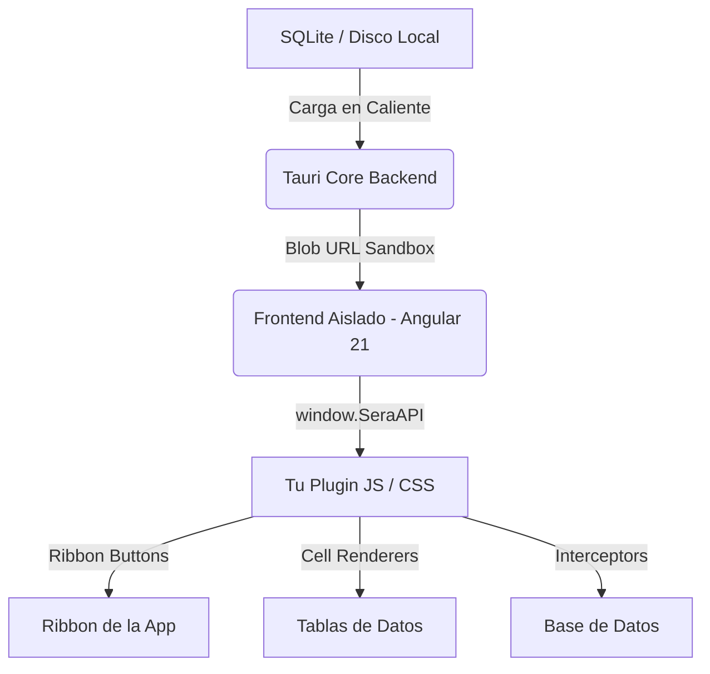

# 🧩 Manual de Desarrollo de Plugins para SERA

> **Guía Técnica de Extensibilidad y Manual de Referencia de la API**  
> *Versión del Core: SERA v4.0.0+ "Poseidón"*

Bienvenido al manual oficial de desarrollo del ecosistema de plugins de **SERA** (Sistema de Expedientes de Registro Avanzado). Este documento está diseñado para guiarte paso a paso, desde la concepción de una idea hasta la publicación y validación de tu extensión en el catálogo descentralizado de nuestra comunidad.

---

## 📖 Índice
1. [Arquitectura y Filosofía del Ecosistema](#1-arquitectura-y-filosofía-del-ecosistema)
2. [Principios de Seguridad y Aislamiento (Sandbox)](#2-principios-de-seguridad-y-aislamiento-sandbox)
3. [Anatomía de un Plugin](#3-anatomía-de-un-plugin)
4. [El Manifiesto (`manifest.json`)](#4-el-manifiesto-manifestjson)
5. [Manual de Referencia de `window.SeraAPI`](#5-manual-de-referencia-de-windowseraapi)
   - [Pestaña Visual (UI)](#ui-visual)
   - [Acceso a Datos (DATA)](#data-datos)
   - [Entorno de Aplicación (ENV)](#env-entorno)
6. [Tutorial Paso a Paso: Tu Primer Plugin](#6-tutorial-paso-a-paso-tu-primer-plugin)
7. [Estilado, CSS y Temas Dinámicos (Claro/Oscuro)](#7-estilado-css-y-temas-dinámicos-clarooscuro)
8. [Publicación y Distribución Descentralizada](#8-publicación-y-distribución-descentralizada)
9. [Lista de Verificación de Seguridad y PR](#9-lista-de-verificación-de-seguridad-y-pr)

---

## 1. Arquitectura y Filosofía del Ecosistema

El motor relacional de SERA (V-Engine) está pensado para ser **100% offline**, priorizando la privacidad absoluta de los datos del operador. La arquitectura de extensibilidad hereda esta filosofía.



### ¿Cómo funciona el Hot-Loading local?
1. **Descarga:** Cuando instalás un plugin del Marketplace, SERA descarga los archivos `.js` y `.css` desde un CDN confiable.
2. **Persistencia Física:** El backend de Rust recibe el contenido y lo guarda físicamente dentro del directorio seguro de datos locales del usuario (`app_data_dir/plugins/<plugin-id>`).
3. **Catálogo Interno:** Registra el plugin y su configuración en la base de datos SQLite interna (`_sera_plugins`).
4. **Hot-Loading seguro:** Al arrancar la aplicación (o al activar un plugin), el core de Rust lee el archivo en caliente y se lo entrega al frontend mediante un canal IPC seguro. El frontend crea un **Blob URL efímero** inyectando dinámicamente las etiquetas `<script>` y `<link>` en el DOM de forma aislada.

---

## 2. Principios de Seguridad y Aislamiento (Sandbox)

> [!IMPORTANT]
> **REGLA DE ORO:** Los plugins tienen estrictamente **prohibido** acceder a `window.__TAURI__` o invocar comandos del sistema de forma directa (`invoke`). Cualquier intento de saltarse el sandbox causará el rechazo inmediato de la extensión en el catálogo oficial.

Para cumplir con la trazabilidad **ISO 27001** y prevenir vulnerabilidades **OWASP (A03: Inyección, A04: Diseño Inseguro)**, la aplicación confina la ejecución del plugin en un Sandbox estricto mediante la pasarela controlada `window.SeraAPI`.

* **Prevención de RCE (Remote Code Execution):** Al empaquetar los plugins como Blob URLs de ejecución única, se bloquea la carga de rutas absolutas del disco, impidiendo ataques de *Directory Traversal*.
* **Mínimo Privilegio:** Un plugin no puede leer cualquier archivo del sistema operativo. Solo puede interactuar con las tablas asignadas a través de la API tipada y sanitizada.
* **Trazabilidad:** Cualquier acción crítica iniciada por un plugin (como la alteración de datos) queda registrada en los logs de auditoría interna de la base de datos SQLite bajo la etiqueta `_sera_audit_log`.

---

## 3. Anatomía de un Plugin

Un plugin de SERA es un repositorio extremadamente liviano. La estructura de carpetas estándar recomendada es:

```text
mi-plugin/
├── manifest.json         # Metadatos del plugin
├── README.md             # Documentación del plugin
├── LICENSE               # Licencia (Recomendada: MIT)
├── dist/
│   ├── index.js          # El bundle de JavaScript sanitizado (obligatorio)
│   └── style.css         # Hoja de estilo CSS (opcional)
```

---

## 4. El Manifiesto (`manifest.json`)

El manifiesto es un archivo JSON plano que contiene la información descriptiva y los puntos de entrada físicos de la extensión.

```json
{
  "id": "sera-plugin-cuit-validator",
  "name": "Validador de CUIT/CUIL 🇦🇷",
  "version": "1.0.0",
  "description": "Valida números de CUIT argentinos en tiempo real en tus columnas de texto y formatea el campo automáticamente.",
  "author": "WolfTeI",
  "icon": "verified_user",
  "entry": "dist/index.js",
  "style": "dist/style.css"
}
```

### Propiedades
* **`id`:** Identificador único en formato kebab-case. Debe coincidir con la carpeta del repositorio y no colisionar con otros plugins.
* **`name`:** Nombre legible que se mostrará en las configuraciones y en el Marketplace.
* **`version`:** Versión del plugin siguiendo el estándar de versionado semántico (SemVer).
* **`description`:** Explicación detallada pero concisa sobre el propósito del plugin.
* **`author`:** Nombre del autor o marca del desarrollador.
* **`icon`:** Icono identificador sacado de [Material Icons](https://fonts.google.com/icons).
* **`entry`:** Ruta relativa al archivo JavaScript empaquetado final.
* **`style`:** Ruta relativa a la hoja de estilo CSS que se inyectará dinámicamente en el encabezado de la app.

---

## 5. Manual de Referencia de `window.SeraAPI`

El objeto global `window.SeraAPI` es tu único puente de comunicación. Se divide en tres áreas funcionales o *namespaces*:

---

### UI (Visual)

Se encarga de inyectar controles interactivos y personalizar el comportamiento del renderizado visual de la grilla de tablas.

#### `SeraAPI.ui.registerRibbonButton(config)`
Agrega un botón con icono interactivo al panel superior (Ribbon) de SERA en la sección de **Extensiones**. Solo será visible cuando tu plugin esté activo.

```typescript
interface RibbonButtonConfig {
  id: string;      // Identificador único del botón
  label: string;   // Texto del botón
  icon: string;    // Nombre de icono Material
  tooltip?: string; // Ayuda visual flotante
  action: () => void | Promise<void>; // Función callback
}
```

*Ejemplo:*
```javascript
SeraAPI.ui.registerRibbonButton({
  id: 'cuit-help-btn',
  label: 'Info CUIT',
  icon: 'info',
  tooltip: 'Hacé click para ver la normativa vigente del CUIT',
  action: () => {
    SeraAPI.env.showNotification('CUIT/CUIL tiene estructura de 11 dígitos numéricos.', 'info');
  }
});
```

#### `SeraAPI.ui.registerSidebarTab(config)`
Añade una pestaña personalizada al panel lateral de navegación izquierdo para flujos de trabajo extensos.

```typescript
interface SidebarTabConfig {
  id: string;
  title: string;
  icon: string;
  action: () => void;
}
```

#### `SeraAPI.ui.registerCellRenderer(columnName, rendererFn)`
Permite interceptar la visualización de celdas en las tablas en tiempo real. Es ideal para dar "superpoderes" a columnas específicas (ej: formatear números, pintar banderas, añadir enlaces directos a mapas, generar botones en celda).

*Parámetros:*
* `columnName` *(string)*: Nombre de la columna (no sensible a mayúsculas/minúsculas).
* `rendererFn` *(function)*: Callback que recibe `(value, row)` y debe retornar una **cadena de texto con formato HTML seguro**.

> [!WARNING]
> Dado que la salida del `CellRenderer` se incrusta en la grilla mediante `innerHTML`, **debés desinfectar cualquier entrada** del usuario utilizando funciones seguras o escapando caracteres especiales para mitigar vulnerabilidades XSS de nivel de cliente.

*Ejemplo:*
```javascript
SeraAPI.ui.registerCellRenderer('cuit', (value, row) => {
  if (!value) return '<span style="opacity:0.3">—</span>';
  const valString = String(value).replace(/\D/g, '');
  if (valString.length === 11) {
    // Formatear visualmente a XX-XXXXXXXX-X
    const formatted = `${valString.substring(0,2)}-${valString.substring(2,10)}-${valString.substring(10)}`;
    return `<span class="badge-cuit" style="font-family:monospace; font-weight:600;"><mat-icon style="font-size:12px;width:12px;height:12px;vertical-align:middle;margin-right:4px">contact_page</mat-icon>${formatted}</span>`;
  }
  // Pintar en rojo si no es un CUIT válido
  return `<span style="color:#f87171;font-weight:600;">⚠️ CUIT Inválido</span>`;
});
```

#### `SeraAPI.ui.registerDashboardWidget(config)`
> [!NOTE]
> **DEPRAVADO (SERA v4.0.0+):** Este método fue marcado como obsoleto por cuestiones de consistencia en el diseño responsivo de la interfaz principal en resoluciones reducidas.
> Actualmente se comporta como un **no-op** seguro para mantener la retrocompatibilidad y evitar que extensiones heredadas fallen al inicializarse en caliente.

---

### DATA (Datos)

Proporciona acceso de solo lectura o ganchos de interceptación a la persistencia SQLite de SERA, manteniendo a salvo el catálogo y las tablas internas.

#### `SeraAPI.data.getTablas()`
Retorna una promesa con la lista de tablas configuradas por el operador.
*Retorno:* `Promise<any[]>` (Colección de objetos descriptivos de tablas).

#### `SeraAPI.data.getCampos(tabla)`
Obtiene la lista estructurada de campos de una tabla en específico.
*Retorno:* `Promise<any[]>`

#### `SeraAPI.data.getContenido(tabla)`
Obtiene los registros guardados físicamente en una tabla en específico.
*Retorno:* `Promise<any[]>` (Arreglo de registros como objetos clave-valor).

#### `SeraAPI.data.onBeforeInsert(tabla, interceptor)`
Registra un interceptor lógico que se ejecuta **antes de insertar o actualizar un registro en la base de datos**. Permite validar los datos, bloquear la inserción arrojando un error o reescribir/formatear campos automáticamente.

*Parámetros:*
* `tabla` *(string)*: Nombre de la tabla a vigilar.
* `interceptor` *(async function)*: Función que recibe el registro (`record`) y debe retornar el `record` modificado (o arrojar un `Error` si no pasa las reglas de negocio).

*Ejemplo:*
```javascript
SeraAPI.data.onBeforeInsert('Proveedores', async (record) => {
  // Asegurar que el campo cuit esté limpio de guiones antes de la persistencia
  if (record.cuit) {
    const raw = String(record.cuit).replace(/\D/g, '');
    if (raw.length !== 11) {
      throw new Error('El CUIT ingresado no posee la cantidad de dígitos requerida (11).');
    }
    
    // Algoritmo básico del dígito verificador del CUIT (Módulo 11)
    const factores = [5, 4, 3, 2, 7, 6, 5, 4, 3, 2];
    let suma = 0;
    for (let i = 0; i < 10; i++) {
      suma += parseInt(raw[i]) * factores[i];
    }
    const verificadorCalculado = 11 - (suma % 11);
    const verificadorReal = parseInt(raw[10]);
    
    if (verificadorCalculado !== verificadorReal && !(verificadorCalculado === 11 && verificadorReal === 0)) {
      throw new Error('El CUIT ingresado posee un dígito verificador inválido.');
    }
    
    // Normalizar a puros números antes de persistir
    record.cuit = raw;
  }
  return record;
});
```

---

### ENV (Entorno)

#### `SeraAPI.env.showNotification(message, type)`
Dispara una alerta visual en la UI de SERA mediante el componente SnackBar nativo de Angular Material.
* `message` *(string)*: Contenido del mensaje.
* `type` *(string)*: Estilo visual. Valores admitidos: `'info' | 'success' | 'warning' | 'error'`. Default: `'info'`.

---

## 6. Tutorial Paso a Paso: Tu Primer Plugin

Vamos a crear el plugin oficial del tutorial: un formateador automático y embellecedor de la columna de CUITs en SERA.

### Paso 1: Configurar el Espacio de Trabajo
Crea una carpeta limpia y crea el manifiesto base:

`manifest.json`:
```json
{
  "id": "sera-cuit-beautifier",
  "name": "Formatos y Validaciones CUIT 🇦🇷",
  "version": "1.0.0",
  "description": "Valida la integridad estructural de los CUITs antes de persistirlos y formatea estéticamente la columna.",
  "author": "TuNombre",
  "icon": "fact_check",
  "entry": "dist/index.js"
}
```

### Paso 2: Desarrollar la Lógica (`dist/index.js`)
Crea tu archivo de distribución. En este caso usaremos JavaScript vainilla envuelto en una IIFE (*Immediately Invoked Function Expression*) para no contaminar el alcance global:

```javascript
(function () {
  'use strict';

  // Verificar la disponibilidad del sandbox al inicializar
  if (typeof window.SeraAPI === 'undefined') {
    console.error('[CUIT Beautifier] Error crítico: SeraAPI no inicializado.');
    return;
  }

  const api = window.SeraAPI;
  const PLUGIN_ID = 'sera-cuit-beautifier';

  // 1. Inyectar botón de Ribbon
  api.ui.registerRibbonButton({
    id: `${PLUGIN_ID}-validate-btn`,
    label: 'Validar Tabla CUIT',
    icon: 'task_alt',
    tooltip: 'Inspecciona y valida la integridad de los proveedores en la tabla',
    action: async () => {
      try {
        const registros = await api.data.getContenido('Proveedores');
        let invalidos = 0;
        
        registros.forEach(r => {
          if (r.cuit && String(r.cuit).replace(/\D/g, '').length !== 11) {
            invalidos++;
          }
        });

        if (invalidos > 0) {
          api.env.showNotification(`Inspección finalizada: Se detectaron ${invalidos} CUITs incorrectos.`, 'warning');
        } else {
          api.env.showNotification('Inspección finalizada: Todos los CUITs son estructuralmente correctos.', 'success');
        }
      } catch (err) {
        api.env.showNotification('No se pudo verificar la tabla. Asegurate de tener una tabla llamada "Proveedores".', 'info');
      }
    }
  });

  // 2. Personalizar la visualización de la celda de la columna "cuit"
  api.ui.registerCellRenderer('cuit', (value) => {
    if (!value) return '<span style="opacity:0.25">S/D</span>';
    
    // Limpiar de caracteres que no sean dígitos
    const clean = String(value).replace(/\D/g, '');
    if (clean.length !== 11) {
      return `<span class="badge-error-cuit" style="color:#f87171;font-weight:600;"><mat-icon style="font-size:14px;width:14px;height:14px;vertical-align:middle;margin-right:2px">error_outline</mat-icon>Erroneo</span>`;
    }
    
    // Armar string estético
    const formatted = `${clean.substring(0, 2)}-${clean.substring(2, 10)}-${clean.substring(10)}`;
    return `<span class="badge-valid-cuit" style="font-family:monospace;font-weight:700;color:var(--sera-primary-color);background:rgba(var(--sera-primary-color-rgb),0.08);padding:2px 8px;border-radius:4px">${formatted}</span>`;
  });

  // 3. Interceptar y limpiar antes de guardar en la DB
  api.data.onBeforeInsert('Proveedores', async (record) => {
    if (record.cuit) {
      const limpio = String(record.cuit).replace(/\D/g, '');
      if (limpio.length !== 11) {
        throw new Error('El CUIT a ingresar debe poseer exactamente 11 números.');
      }
      record.cuit = limpio; // Guardar normalizado, sin guiones
    }
    return record;
  });

  // Notificación de carga
  api.env.showNotification('🧩 Validador y Formateador de CUITs activo.', 'success');

})();
```

---

## 7. Estilado, CSS y Temas Dinámicos (Claro/Oscuro)

SERA soporta cambio de temas dinámicos (Claro y Oscuro) a través de clases jerárquicas y variables HSL locales.
Si tu plugin declara estilos en un archivo `.css` (indicado en `"style"` de tu manifiesto), recordá seguir estas buenas prácticas:

1. **Namespace de Estilos:** Evitá declarar estilos globales que afecten a toda la app. Envolvé tus selectores en clases que coincidan con tu ID de plugin:
   ```css
   /* Correcto */
   .badge-valid-cuit {
     border: 1px solid rgba(var(--sera-primary-color-rgb), 0.2);
   }
   
   /* Incorrecto - Afectará a los botones nativos */
   button {
     background-color: red !important;
   }
   ```
2. **Uso de Variables CSS del Anfitrión:**
   Utilizá las variables declaradas por la aplicación base para heredar la paleta tipográfica y colores activos de forma nativa:
   * `--sera-primary-color`: Color principal de resalte.
   * `--sera-primary-color-rgb`: Color principal en formato RGB (útil para transparencias).
   * `--sera-bg-color`: Fondo de pantalla general.
   * `--sera-surface-color`: Fondo de tarjetas y menús.
   * `--sera-text-color`: Color de fuentes generales.
3. **Selector de Tema Claro/Oscuro:**
   Adapta los colores en base a si la clase `.theme-light` está activa en la jerarquía superior:
   ```css
   .badge-valid-cuit {
     background: rgba(255,255,255,0.05); /* Modo Oscuro */
   }
   
   :host-context(.theme-light) .badge-valid-cuit {
     background: rgba(0,0,0,0.05); /* Modo Claro */
   }
   ```

---

## 8. Publicación y Distribución Descentralizada

El Marketplace de SERA es completamente **descentralizado**. No cobramos comisiones ni tenemos una base de datos centralizada de servidores propietarios.
Para distribuir tu plugin a todo el mundo:

1. **Subí tu código a un repositorio público de GitHub.**
2. **Creá un Tag/Release de Git:** Por ejemplo, `v1.0.0`. Esto es fundamental para que el CDN configure la caché y distribuya los bundles correctamente.
3. **Configurá el CDN con jsDelivr:**
   Cualquier archivo de un repositorio de GitHub público se convierte automáticamente en una URL de distribución CDN de alta velocidad de forma gratuita:
   * **Entrada JS:** `https://cdn.jsdelivr.net/gh/TU_USUARIO/TU_REPO@TU_VERSION/dist/index.js`
   * **Estilos CSS:** `https://cdn.jsdelivr.net/gh/TU_USUARIO/TU_REPO@TU_VERSION/dist/style.css`
4. **Enviá tu solicitud al Catálogo Central:**
   Realizá un *Fork* del repositorio del [Marketplace Central](https://github.com/carlosprost/sera-plugins-marketplace), agregá la descripción de tu plugin con sus respectivas URLs de jsDelivr al archivo central `plugins.json`, y abrí un **Pull Request (PR)**.

---

## 9. Lista de Verificación de Seguridad y PR

Antes de aprobar e integrar una extensión al catálogo oficial del Marketplace, el equipo técnico auditará minuciosamente el código del Pull Request contra los siguientes estándares:

* [ ] **Cero llamadas a `__TAURI__`:** El código no debe intentar inyectar dependencias nativas de Tauri ni romper el aislamiento Sandbox.
* [ ] **Sanitización del DOM:** Los retornos HTML de los `registerCellRenderer` deben sanitizarse adecuadamente para anular la inyección de etiquetas arbitrarias `<script>` o manipulaciones inusuales del DOM (prevenir vulnerabilidades XSS en el cliente).
* [ ] **Privacidad Offline Total:** El plugin no debe realizar solicitudes `fetch` o `xhr` a endpoints externos (APIs, servidores analíticos corporativos, etc.) sin justificación justificada o configuraciones previas del operador. La recopilación silenciosa de telemetría o de información confidencial de las tablas provocará el **bloqueo perpetuo** del desarrollador.
* [ ] **Control de Excepciones:** Las promesas y llamadas asíncronas deben estar cubiertas bajo bloques `try-catch` para asegurar que el sistema se recupere con gracia ante cualquier fallo en las tablas.
